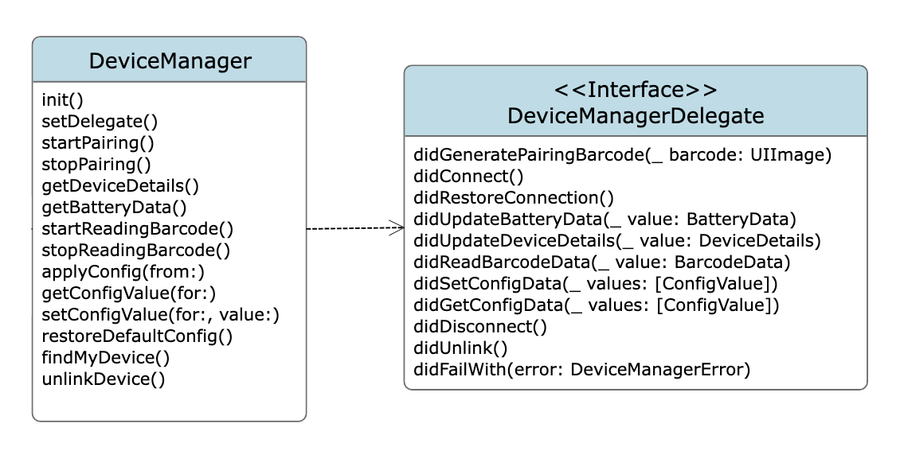
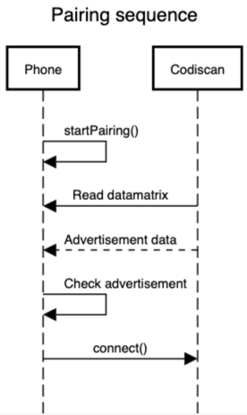
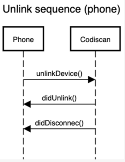
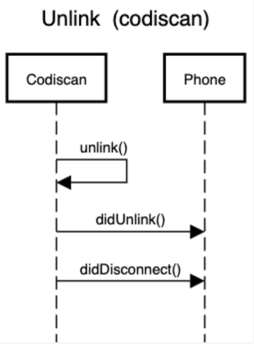
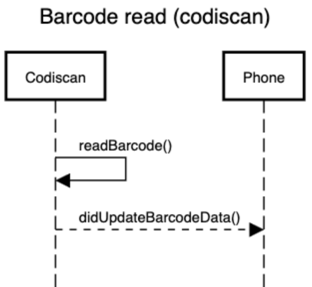

# DatalogicSDK iOS

- [Overview](#overview)
- [Sample App](#sample-app)
- [Architecture](#architecture)
- [Documentation](#documentation)

## Getting started

The DatalogicSDK empowers users to write iOS applications that interface with a connected CODiScan™ HS7600 wearable Bluetooth bar code reader.

## Using the SDK

1. Import DatalogicSDK as a SPM dependency.

    - Open your Xcode project.

    - Go to File > Add Packages...

    - Enter the Git URL of the package

    - Select the version rule (e.g., "Up to Next Major").

    - Click Add Package.

2. Configure BLE permission request
    
    To use Bluetooth Low Energy (BLE) features in your Swift app, you must add usage strings in your Info.plist, such as:

    ```
        <key>NSBluetoothAlwaysUsageDescription</key>
        <string>This app needs Bluetooth access to discover and connect to nearby devices.</string>
    ```

2. Import and Use in Code

```
import DatalogicSDK

print(Constants.version)
```

## Sample App

https://github.com/datalogic/datalogic-ios-samples

The CODiScan SDK Sample App showcases the capabilities of the DatalogicSDK in four tabs:

- Code: allows device linking (with barcode) and unlinking, triggering a barcode scan, triggering a "find my device" command, sharing barcodes log.
- Config: allows loading and applying a xml config file, applying the default configuration.
- Battery: shows the last received battery data
- Logs: allows to read, share and clear the sdk logs.

## Architecture

### Class



### Sequence










## Documentation

### Device Manager

The main class responsible for managing BLE device interactions, including pairing, configuration, barcode reading, and streaming device data.

This class offers:

- Device pairing with dynamic barcode generation.
- Reading barcodes from connected devices.
- Applying device configurations via XML files.
- Getting and setting single configuration values.
- Streaming device info and battery stats.
- Graceful handling of disconnection, errors, and device unlinking.

#### Initializers

_init()_

Initializes a new instance of DeviceManager.

_func setDelegate(DeviceManagerDelegate?)_

Sets the delegate to receive device events.

```swift
let manager = DeviceManager()
manager.setDelegate(self)
```

#### Instance Methods

##### Pairing

_func startPairing()_

Begins the pairing process with the BLE device.

_func stopPairing()_

Stops the pairing process.

```swift
manager.startPairing()   // Begin pairing process
manager.stopPairing()    // Cancel pairing
```

_func appMovedToForeground()_

Call this method to notify that the hosting app moved to foreground. It is important to call this method whenever the app moves to foreground otherwise the SDK could have problems linking with a device previously linked and unlinked.

```swift
struct ContentView: View {
    @Environment(\.scenePhase) private var scenePhase

    let deviceManager = DeviceManager()

    var body: some View {
            VStack {
                Text("Your app")
            }
            .onChange(of: scenePhase) { newPhase in
                if newPhase == .active {
                    deviceManager.appMovedToForeground()
                }
            }
    }
}
```


##### Barcode read

_func startReadingBarcode()_

Sends a command to begin barcode scanning on the device.

_func stopReadingBarcode()_

Sends a command to stop barcode scanning on the device.

```swift
manager.startReadingBarcode()
manager.stopReadingBarcode()
```

##### Configuration

_func applyConfig(from: URL)_

Applies configuration to the device from a local XML file.

_func restoreDefaultConfig()_

Restores the device to its default configuration.

_func setConfigValue(for: String, value: String)_

Sets a configuration value on the device.

_func getConfigValue(for: String)_

Restores the device to its default configuration.

```swift
manager.applyConfig(from: configURL)                      // Apply configuration from XML
manager.setConfigValue(for: "code", value: "value")       // Set single value
manager.getConfigValue(for: "code")                       // Read config value
manager.restoreDefaultConfig()                            // Reset config
```

##### Commands

_func findMyDevice()_

Sends a “find my device” command to the device.

_func unlinkDevice()_

Starts the unlinking process to disconnect and unlink the device.

```swift
manager.findMyDevice()      // Triggers device indicator
manager.unlinkDevice()      // Unlinks the device
```

---

### DeviceManagerDelegate

A protocol that defines the delegate methods for DeviceManager. Use this to respond to key events like connection, disconnection, barcode reads, and errors.

_func didConnect()_

Called when a device is connected.

_func didDisconnect()_

Called when the device disconnects.

_func didFailWith(error: DeviceManagerError)_

Called when a device-related error occurs.

_func didGeneratePairingBarcode(UIImage)_

Called when a pairing barcode is generated.

_func didGetConfigData([ConfigValue])_

Called when configuration values are successfully get from the device.

_func didReadBarcodeData(BarcodeData)_

Called when a barcode is read from the device.

_func didRestoreConnection()_

Called when the connection to a previously linked device is restored.

_func didSetConfigData([ConfigValue])_

Called when configuration values are successfully set on the device.

_func didUnlink()_

Called when the device is unlinked.

_func didUpdateBatteryData(BatteryData)_

Called when new battery data is received.

_func didUpdateDeviceDetails(DeviceDetails)_

Called when updated device details are received.

---

### BarcodeData

Represents the data of a barcode.

#### Instance Properties

_let barcodeID: String_

Represents barcode type.

_let data: String_

Represents raw data converted to a string.

_let rawData: [UInt8]_

Represents raw data in bytes.

---

### ConfigValue

Represents a codiscan configuration value

#### Instance Properties

_var code: String_

The code of the configuration property

_var data: String_

The value of the configuration property

### DeviceDetails

A simple struct represeting information of a codiscan device

#### Instance Properties

_let model: String?_

Codiscan device model name

_let serialNumber: String?_

Codiscan device serial number

_let swRevision: String?_

Codiscan device firmware version

---

### BatteryDataField

Represents the key of a battery data field

#### Enumeration Cases

_case batteryCurrent_

Battery latest current

_case batteryCycleCount_

Battery cycle count

_case batterySoC_

Battery state of charge

_case batterySoH_

Battery state of health

_case batteryTemp_

Battery latest temperature (in tenths of a celsius degree)

#### Instance Properties

_var description: String_

Human readable description of a battery data field

---

### BleManagerError

Represents an error in the BLE layer

#### Enumeration Cases

_case connectionFailed(Error)_

The connection has failed with the associated error value

_case disconnectedPeripheral_

The codiscan device has been disconnected

---

### DeviceManagerError

Represents errors that may occur while using the DeviceManager.

#### Enumeration Cases

_case alreadyPaired_

The device is already paired and it should be manually unpaired from the iPhone settings to be connected again.

_case barcodeGenerationFailed_

Barcode generation failed.

_case ble(BleManagerError)_

An error from the BLEManager layer.

_case configParserInitFailed_

Failed to initialize the configuration parser.

_case configParsingFailed_

Failed to parse the configuration file.
